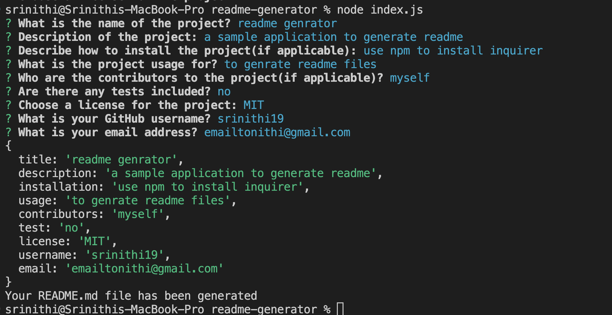

# readme-generator

## Description

This application is a command line interface that generates README.md using node.js and npm inquirer package.

## Technology Used

| Nodejs | [https://nodejs.org/docs/latest-v16.x/api/](https://nodejs.org/docs/latest-v16.x/api/)     |  
| Inquirer | [https://www.npmjs.com/package/inquirer/v/8.2.4#question](https://www.npmjs.com/package/inquirer/v/8.2.4#question)     | 

## Usage

This app automates the writing of the file by prompting the user to answer a series of questions about the project. After answering all the questions, a readme file is generated for the user.

## Demo

sample readme generated using this app

## Links

Github Repo - https://github.com/srinithi19/readme-generator  
Application URL - https://srinithi19.github.io/readme-generator/

